# Live Chat Application

A full-stack real-time chat platform built with **React, Vite, Node.js, Express, MongoDB, and Stream**.

The application allows users to create profiles, discover people, send friend requests, chat in real time, make video calls, manage blocked users, and report users. It also includes an admin panel for user management and report review.

## Overview

This project is divided into two applications:

* `frontend/` — React client built with Vite
* `backend/` — Express API with MongoDB, authentication, and Stream integration

The application is designed around language-learning style social matching, where users complete their profile, discover other users, connect with them, and communicate through real-time chat and video calls.

## Features

### Authentication

* User signup and login
* Logout
* Forgot/reset password
* JWT-based authentication
* Secure HTTP-only authentication cookies

### User Profile & Discovery

* Profile onboarding
* Avatar, bio, languages, and location
* Discover other users
* Search users by username
* Send friend requests
* Accept or reject friend requests

### Real-Time Communication

* One-to-one real-time messaging
* Stream Chat integration
* Video calling with Stream Video
* Call interface

### User Safety

* Block users
* Unblock users
* Report users
* View blocked users
* Friend request notifications

### Customization

* Multiple theme options
* Theme selection interface

### Admin Panel

* Admin dashboard
* View registered users
* Activate/deactivate user accounts
* View submitted reports
* Admin account automatically seeded from environment variables

## Screenshots

### Authentication

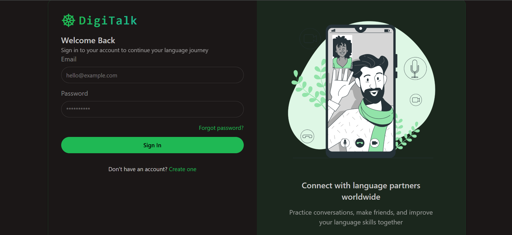

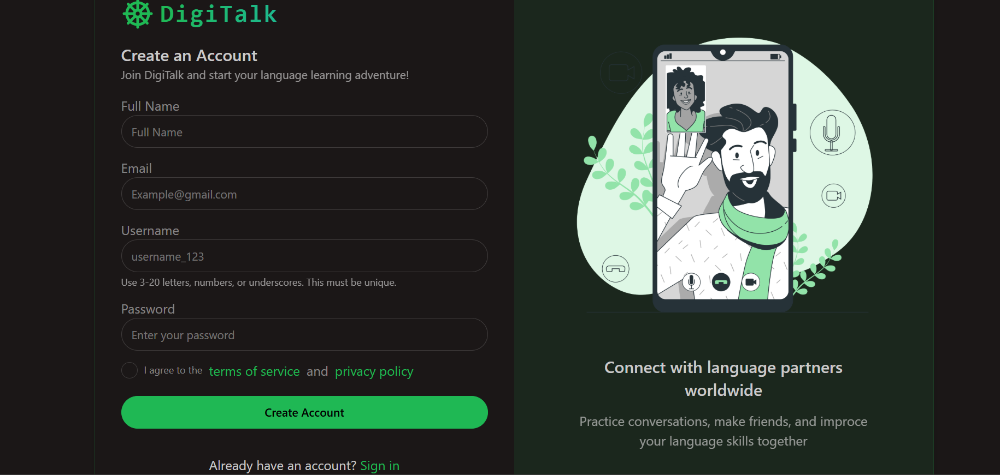

### User Dashboard

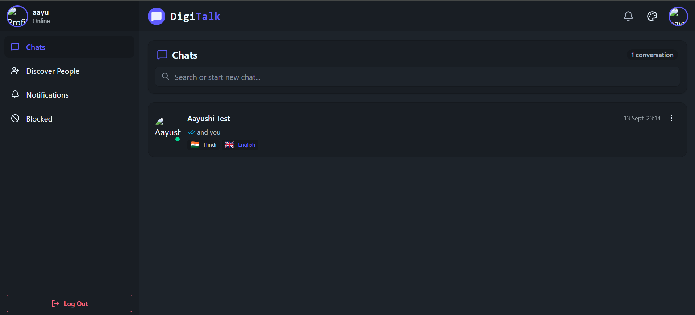

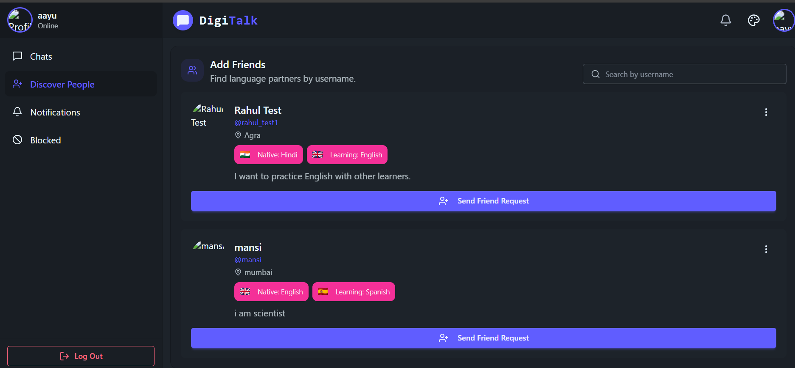

### Chat & Communication

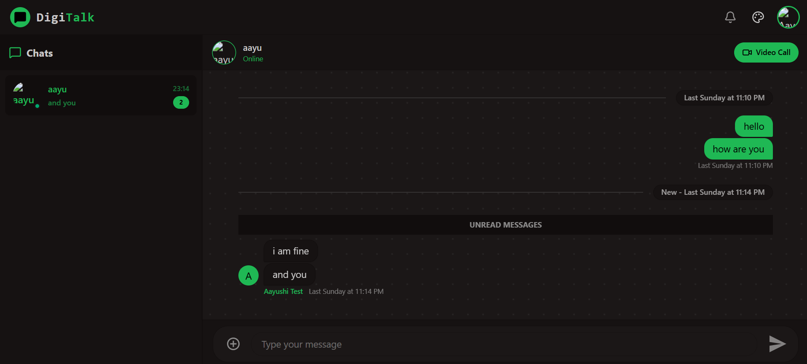

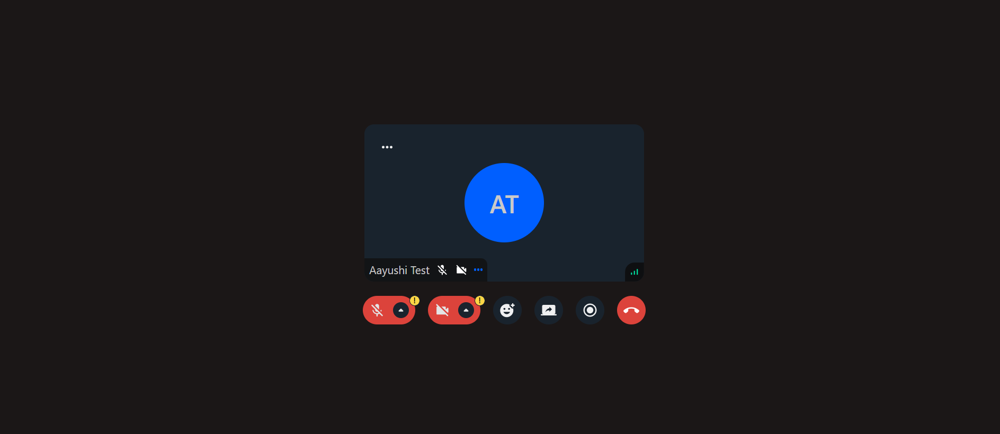

### Notifications & Safety

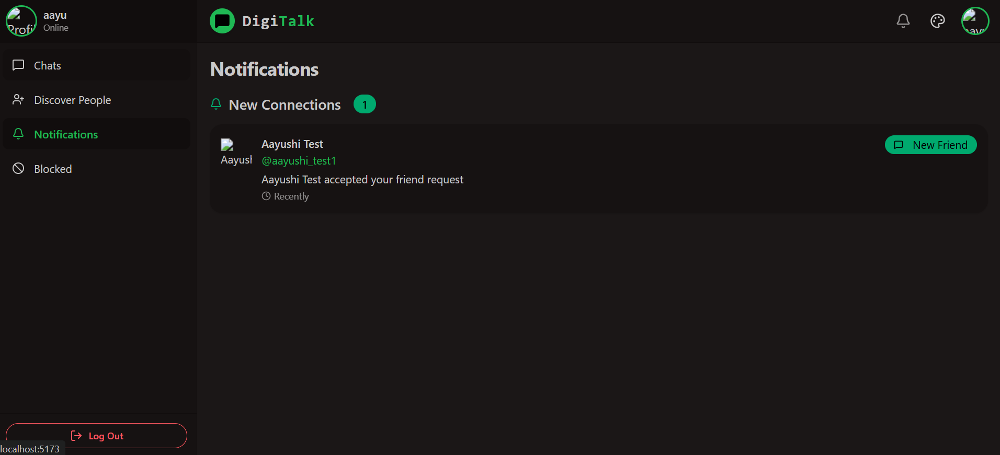

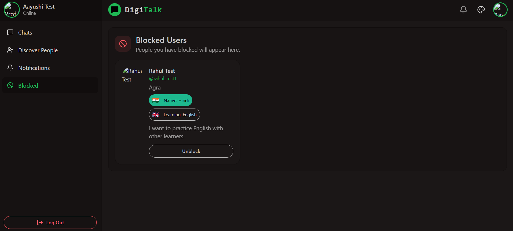

### Theme Customization

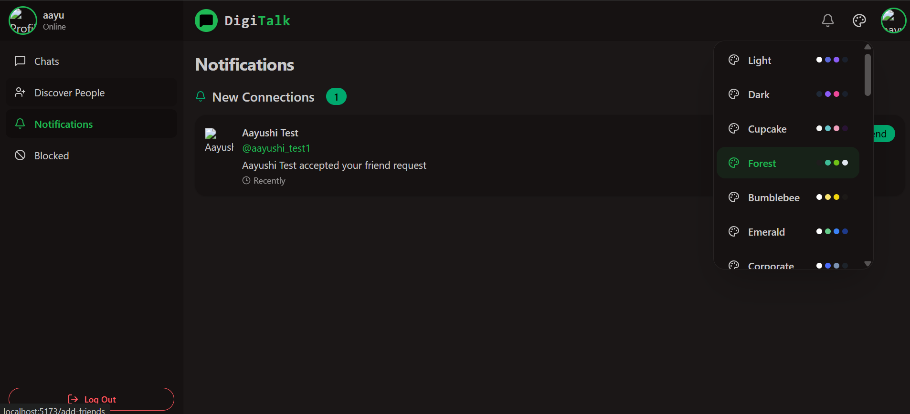

### Admin Panel

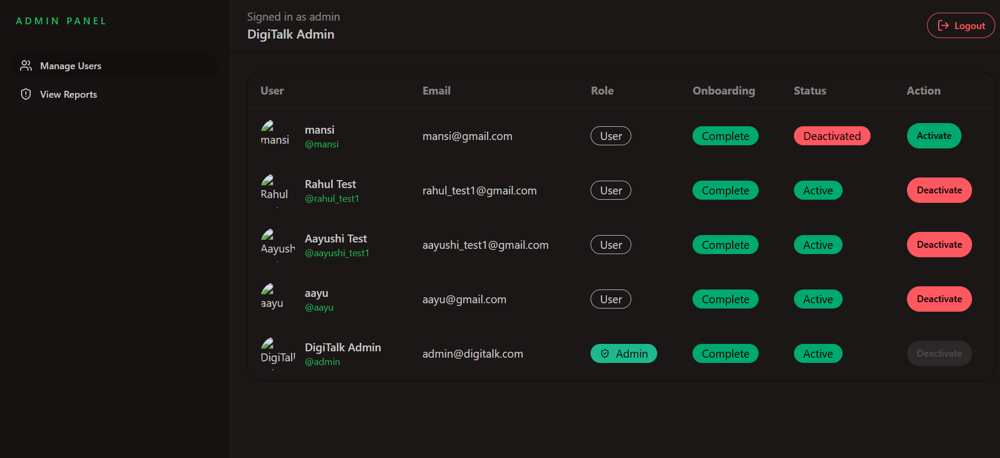

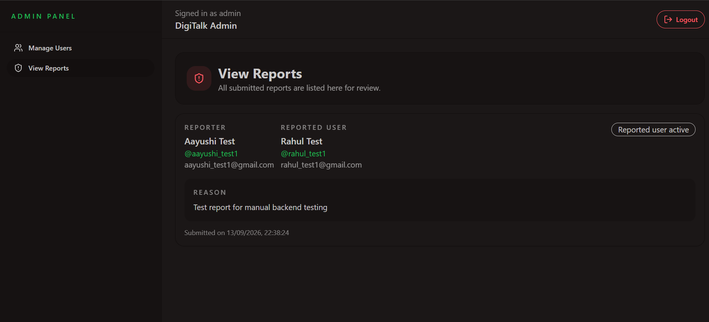

## Tech Stack

### Frontend

* React 19
* Vite
* Tailwind CSS
* DaisyUI
* TanStack React Query
* React Router
* Zustand
* Axios
* Stream Chat React SDK
* Stream Video React SDK

### Backend

* Node.js
* Express
* MongoDB
* Mongoose
* JWT
* bcryptjs
* cookie-parser
* CORS
* dotenv
* Stream Chat SDK

## Project Structure

```text
Live_chat/
├── backend/
│   ├── api/
│   │   └── index.js
│   ├── src/
│   │   ├── controllers/
│   │   ├── lib/
│   │   ├── models/
│   │   ├── routes/
│   │   └── server.js
│   ├── .env.example
│   ├── package.json
│   └── vercel.json
│
├── frontend/
│   ├── public/
│   ├── src/
│   │   ├── admin/
│   │   ├── components/
│   │   ├── hooks/
│   │   ├── lib/
│   │   ├── pages/
│   │   └── store/
│   ├── .env.example
│   └── package.json
│
├── screenshots/
│   ├── login.png
│   ├── signup.png
│   ├── dashboard.png
│   ├── livechatdiscoverpeople.png
│   ├── inbox.png
│   ├── call.png
│   ├── notifications.png
│   ├── blocked-users.png
│   ├── change-theme.png
│   ├── admin-dashboard.png
│   └── view-reports.png
│
├── .gitignore
└── README.md
```

## Environment Variables

### Backend

Create a `.env` file inside the `backend/` folder:

```env
PORT=3000
MONGO_URI=your_mongodb_connection_string
JWT_SECRET_KEY=your_jwt_secret

STREAM_API_KEY=your_stream_api_key
STREAM_API_SECRET=your_stream_api_secret

CLIENT_URL=http://localhost:5173

ADMIN_EMAIL=admin@example.com
ADMIN_PASSWORD=your_admin_password
ADMIN_FULL_NAME=Admin
ADMIN_USERNAME=admin
```

### Frontend

Create a `.env` file inside the `frontend/` folder:

```env
VITE_STREAM_API_KEY=your_stream_api_key
VITE_API_URL=http://localhost:3000
```

> Never commit real `.env` files, API keys, passwords, or secrets to GitHub.

## Installation

Clone the repository:

```bash
git clone https://github.com/Aayushi-800/Live_chat.git
cd Live_chat
```

### Backend

```bash
cd backend
npm install
```

### Frontend

Open a second terminal:

```bash
cd frontend
npm install
```

## Running the Project

### Start Backend

```bash
cd backend
npm run dev
```

Backend runs on:

```text
http://localhost:3000
```

### Start Frontend

Open another terminal:

```bash
cd frontend
npm run dev
```

Frontend runs on:

```text
http://localhost:5173
```

## Admin Access

The backend automatically creates or updates an admin account using the following environment variables:

* `ADMIN_EMAIL`
* `ADMIN_PASSWORD`
* `ADMIN_FULL_NAME`
* `ADMIN_USERNAME`

After logging in with the admin account, the admin can access the admin panel to manage users and review reports.

## Available Scripts

### Backend

```bash
npm run dev
```

Starts the backend server with file watching.

### Frontend

```bash
npm run dev
```

Starts the Vite development server.

```bash
npm run build
```

Creates a production build.

```bash
npm run preview
```

Previews the production build locally.

```bash
npm run lint
```

Runs ESLint.

## Deployment

The project is structured for separate frontend and backend deployments.

### Frontend

The frontend can be deployed as a Vite application on a hosting platform such as Vercel.

Set:

```env
VITE_STREAM_API_KEY=your_stream_api_key
VITE_API_URL=https://your-backend-domain
```

### Backend

The backend includes:

```text
backend/api/index.js
backend/vercel.json
```

which can be used for serverless deployment.

Production environment variables should include:

```env
MONGO_URI=your_mongodb_connection_string
JWT_SECRET_KEY=your_jwt_secret
STREAM_API_KEY=your_stream_api_key
STREAM_API_SECRET=your_stream_api_secret
CLIENT_URL=https://your-frontend-domain

ADMIN_EMAIL=admin@example.com
ADMIN_PASSWORD=your_admin_password
ADMIN_FULL_NAME=Admin
ADMIN_USERNAME=admin

NODE_ENV=production
```

## API Overview

### Authentication

* `POST /api/auth/signup`
* `POST /api/auth/login`
* `POST /api/auth/logout`
* `POST /api/auth/forgot-password`
* `POST /api/auth/onboarding`
* `GET /api/auth/me`

### Users

* `GET /api/user`
* `GET /api/user/friends`
* `GET /api/user/blocked-users`
* `GET /api/user/friend-requests`
* `GET /api/user/outgoing-friend-requests`
* `POST /api/user/friend-request/:id`
* `PUT /api/user/accept-friend-request/:id`
* `PUT /api/user/reject-friend-request/:id`
* `POST /api/user/block/:id`
* `POST /api/user/unblock/:id`
* `POST /api/user/report/:id`

### Chat

* `GET /api/chat/token`

### Admin

* `GET /api/admin/users`
* `PATCH /api/admin/users/:id/active`
* `GET /api/admin/reports`

## Future Improvements

* Add automated tests
* Add online presence indicators
* Add typing indicators
* Add pagination and filtering
* Add report status management
* Improve moderation features
* Add more communication features

## License

This project is currently unlicensed.
